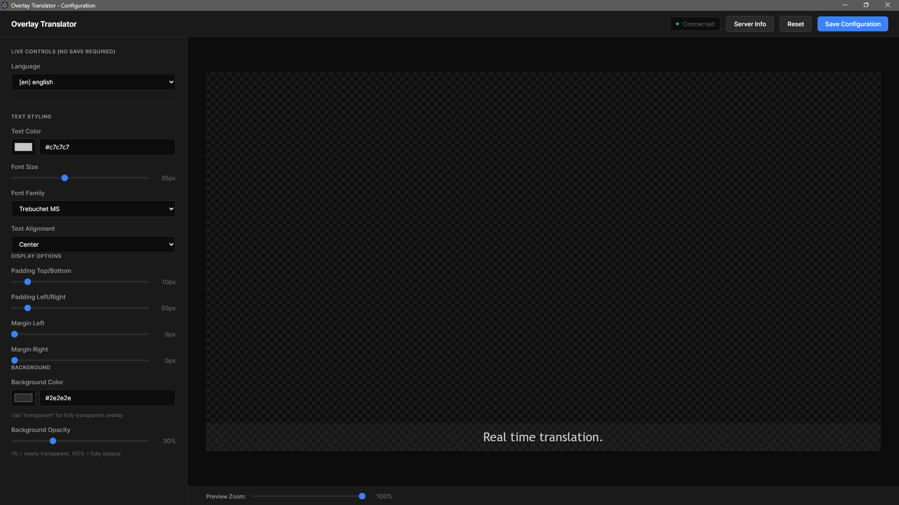
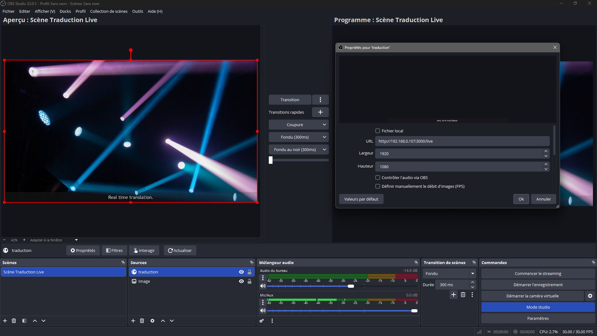

# Overlay Translator

Affiche en temps réel les traductions de **Whispering-UI** sur votre logiciel de streaming (OBS, vMix, XSplit...).

## Comment ça marche ?

```
🎤 Vous parlez → 🔊 Whispering-UI traduit → 📺 Overlay affiche → 🎥 Logiciel de streaming capture
```

## Prérequis

### Whispering-UI (obligatoire)
- Téléchargez : https://github.com/Sharrnah/whispering-ui
- **Lancez-le AVANT d'utiliser Overlay Translator**

### Node.js
- Version 16+ : https://nodejs.org/

## Installation

```bash
npm install
npm start
```

## Utilisation rapide

### 1️⃣ Démarrez Whispering-UI
Lancez Whispering-UI avant cette application.

### 2️⃣ Lancez Overlay Translator
```bash
npm start
```



**Panneau gauche** : Paramètres (couleur, taille, police, etc.)
**Panneau droit** : Aperçu en temps réel

**Indicateur de connexion :**
- 🟢 Vert = Connecté
- 🔴 Gris/Rouge = Vérifiez que Whispering-UI tourne

### 3️⃣ Ajoutez l'overlay dans votre logiciel

#### OBS Studio / XSplit
1. Ajoutez une **Source de navigateur** (Browser Source)
2. URL : `http://localhost:3000/live`
3. Taille : 1920x1080 (ajustez selon votre résolution)



#### vMix
1. Ajoutez un **Input Web Browser**
2. URL : `http://localhost:3000/live`

### 4️⃣ Personnalisez
- Modifiez les paramètres dans le panneau gauche
- Cliquez sur **"Save Configuration"**
- L'overlay se met à jour en temps réel

## Contrôle à distance

Contrôlez l'overlay depuis votre téléphone/tablette :

1. Cliquez sur **"Server Info"** dans l'application
2. Ouvrez l'URL affichée sur votre appareil mobile

## Dépannage

**Pas de connexion (indicateur gris/rouge) :**
- Vérifiez que Whispering-UI tourne (`http://localhost:5000`)

**L'overlay ne s'affiche pas :**
- Vérifiez l'URL : `http://localhost:3000/live`
- Rafraîchissez la source dans votre logiciel

**Pas de traductions :**
- Vérifiez que Whispering-UI reçoit bien l'audio
- Testez `http://localhost:3000/live` dans un navigateur